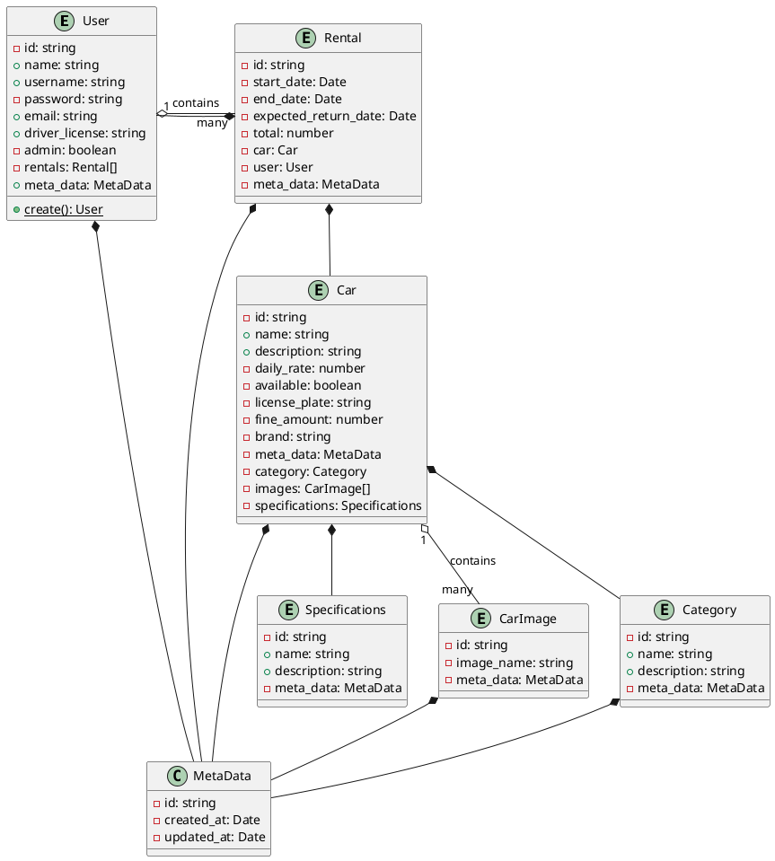

## Alucar - Aluguel de Carros

---

### Reqs

### Architecture

```plantuml
@startuml
entity User {
  - id: string
  + name: string
  + username: string
  - password: string
  + email: string
  + driver_license: string
  - admin: boolean
  - rentals: Rental[]
  + meta_data: MetaData
  + {static} create(): User
}

entity Rental {
  - id: string
  - start_date: Date
  - end_date: Date
  - expected_return_date: Date
  - total: number
  - car: Car
  - user: User
  - meta_data: MetaData
}

entity Car {
  - id: string
  + name: string
  + description: string
  - daily_rate: number
  - available: boolean
  - license_plate: string
  - fine_amount: number
  - brand: string
  - meta_data: MetaData
  - category: Category
  - images: CarImage[]
  - specifications: Specifications
}

entity Specifications {
  - id: string
  + name: string
  + description: string
  - meta_data: MetaData
}

entity CarImage {
  - id: string
  - image_name: string
  - meta_data: MetaData
}

entity Category {
  - id: string
  + name: string
  + description: string
  - meta_data: MetaData
}

class MetaData {
  - id: string
  - created_at: Date
  - updated_at: Date
}

User "1" o-left- "many" Rental : contains
Rental *-up- User
User *-right- MetaData
Rental *-- MetaData
Rental *-- Car
Car *-- Specifications
Car *-- MetaData
Car "1" o-down- "many" CarImage : contains
Car *-- Category
CarImage *-down- MetaData
Category *-down- MetaData

@enduml
```
